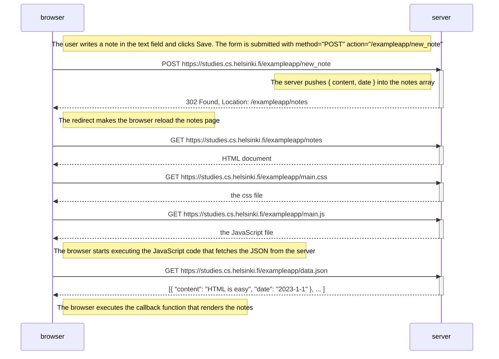

# 0.4: New note

Sequence of events when a user writes text in the form on
https://studies.cs.helsinki.fi/exampleapp/notes and presses *Save*.

```mermaid
sequenceDiagram
    participant browser
    participant server

    Note right of browser: The user writes a note in the text field and clicks Save. The form is submitted with method="POST" action="/exampleapp/new_note"

    browser->>server: POST https://studies.cs.helsinki.fi/exampleapp/new_note
    activate server
    Note left of server: The server pushes { content, date } into the notes array
    server-->>browser: 302 Found, Location: /exampleapp/notes
    deactivate server

    Note right of browser: The redirect makes the browser reload the notes page

    browser->>server: GET https://studies.cs.helsinki.fi/exampleapp/notes
    activate server
    server-->>browser: HTML document
    deactivate server

    browser->>server: GET https://studies.cs.helsinki.fi/exampleapp/main.css
    activate server
    server-->>browser: the css file
    deactivate server

    browser->>server: GET https://studies.cs.helsinki.fi/exampleapp/main.js
    activate server
    server-->>browser: the JavaScript file
    deactivate server

    Note right of browser: The browser starts executing the JavaScript code that fetches the JSON from the server

    browser->>server: GET https://studies.cs.helsinki.fi/exampleapp/data.json
    activate server
    server-->>browser: [{ "content": "HTML is easy", "date": "2023-1-1" }, ... ]
    deactivate server

    Note right of browser: The browser executes the callback function that renders the notes
```
