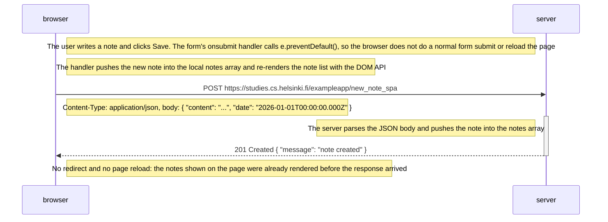

# 0.6: New note (single page app)

Sequence of events when a user creates a new note on
https://studies.cs.helsinki.fi/exampleapp/spa.

```mermaid
sequenceDiagram
    participant browser
    participant server

    Note right of browser: The user writes a note and clicks Save. The form's onsubmit handler calls e.preventDefault(), so the browser does not do a normal form submit or reload the page

    Note right of browser: The handler pushes the new note into the local notes array and re-renders the note list with the DOM API

    browser->>server: POST https://studies.cs.helsinki.fi/exampleapp/new_note_spa
    Note right of browser: Content-Type: application/json, body: { "content": "...", "date": "2026-01-01T00:00:00.000Z" }
    activate server
    Note left of server: The server parses the JSON body and pushes the note into the notes array
    server-->>browser: 201 Created { "message": "note created" }
    deactivate server

    Note right of browser: No redirect and no page reload: the notes shown on the page were already rendered before the response arrived
```
